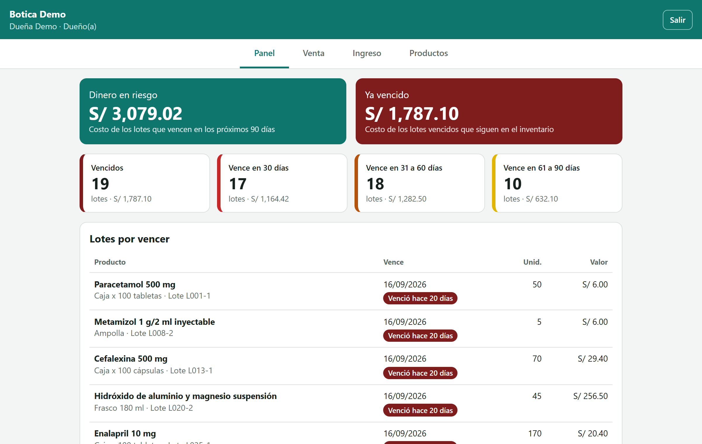
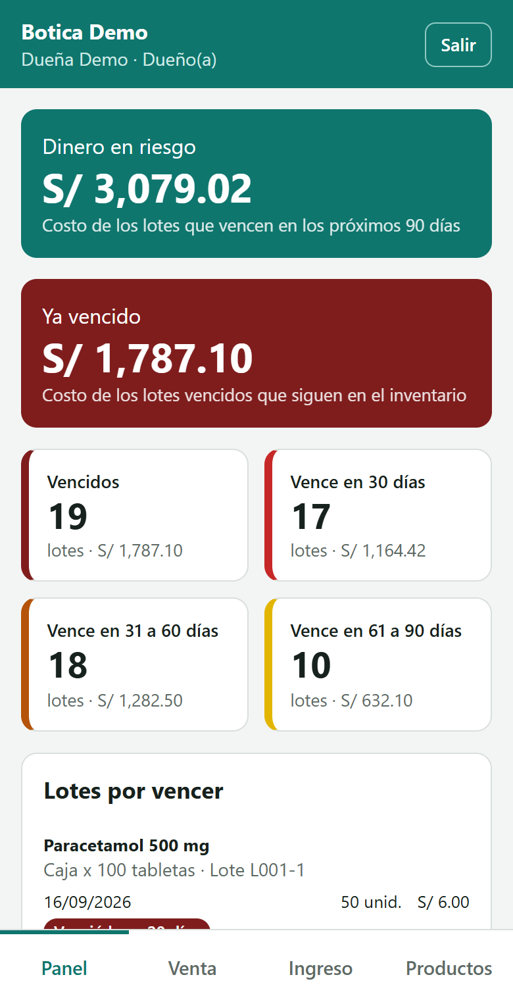
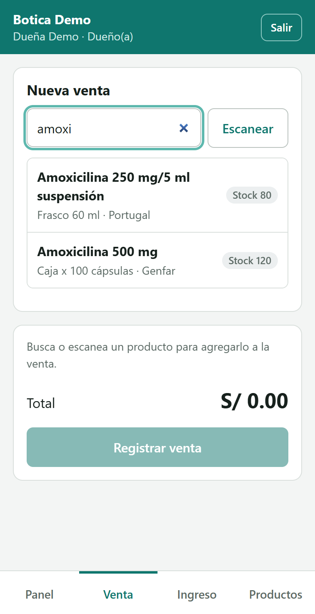

# Control de inventario y vencimientos para boticas y veterinarias

Sistema web para que un negocio pequeño sepa qué tiene en stock, qué está por vencer y cuánto dinero puede perder si no lo vende a tiempo. Pensado para boticas y veterinarias independientes de Huacho (Perú), y para usarse desde el celular en el mostrador.

No es un sistema de caja ni emite comprobantes electrónicos: es un complemento de control de inventario.

| Panel en escritorio | Panel en celular | Venta en celular |
| --- | --- | --- |
|  |  |  |

## Qué hace

- **Panel del dueño**: lotes vencidos y por vencer a 30, 60 y 90 días, productos con stock bajo y "dinero en riesgo" (soles, al costo, en lotes que vencen en los próximos 90 días).
- **Ventas con FEFO** (*first expired, first out*): al vender, el sistema descuenta primero del lote que vence antes y le dice al vendedor de qué lote entregar.
- **Ingreso de mercadería por lotes**, con número de lote, fecha de vencimiento, cantidad y costo.
- **Productos** con búsqueda y lectura de código de barras desde la cámara.
- **Dos roles**: `DUENO` (ve todo y configura) y `VENDEDOR` (registra ingresos y ventas).
- **Varios negocios** en la misma instalación: cada botica o veterinaria entra con su cuenta y solo ve sus datos.

## Tecnologías

| Parte | Stack |
| --- | --- |
| [backend/](backend/) | NestJS, TypeScript, Prisma 7, PostgreSQL 16, JWT, Jest |
| [frontend/](frontend/) | React 19, Vite, TypeScript, React Router, html5-qrcode |

## Decisiones técnicas

- **El stock no se guarda, se calcula**: es la suma de los lotes no vencidos. No puede haber dos números que se contradigan.
- **Ventas concurrentes seguras**: cada venta corre en una transacción que bloquea los lotes con `SELECT ... FOR UPDATE`. Dos cajas no pueden vender la misma unidad, y hay pruebas automáticas que lo demuestran contra PostgreSQL real.
- **Defensa en capas contra la sobreventa**: validación de entrada, bloqueo en la transacción y un `CHECK (cantidad_actual >= 0)` en la base.
- **Aislamiento entre negocios**: el negocio viaja en el token firmado y todas las consultas filtran por él. Los datos de otro negocio responden 404.
- **Trazabilidad**: todo cambio de stock queda en la tabla `movimientos`.
- **Fechas en hora de Perú**: "hoy" se calcula en `America/Lima`, no con el reloj del servidor.

El detalle de cada una está en el [README del backend](backend/README.md).

## Cómo ejecutarlo

Requisitos: Node.js 24 y Docker Desktop.

```bash
# Terminal 1: base de datos y API (http://localhost:3001/api)
cd backend
npm install
cp .env.example .env        # y cambia JWT_SECRET
npm run db:up
npm run db:generate
npm run db:migrate
npm run db:seed
npm run start:dev

# Terminal 2: aplicación web (http://localhost:5173)
cd frontend
npm install
npm run dev
```

Cuentas de demostración (contraseña `Demo1234`):

| Correo | Negocio | Rol |
| --- | --- | --- |
| `dueno@demo.pe` | Botica Demo | Dueña |
| `vendedor@demo.pe` | Botica Demo | Vendedor |
| `veterinaria@demo.pe` | Veterinaria Demo | Dueño |

## Pruebas

```bash
cd backend
npm test            # unitarias
npm run test:e2e    # de extremo a extremo, en una base separada (botica_test)
```

Cubren el reparto FEFO, stock insuficiente, lotes vencidos, ventas simultáneas, permisos por rol, aislamiento entre negocios y los cálculos del panel.

## Estado

Hecho: autenticación y roles, productos, lotes, ventas FEFO, panel, multi-negocio y la aplicación web base.

Pendiente: importar inventario desde Excel, reportes en Excel y PDF, y despliegue.
